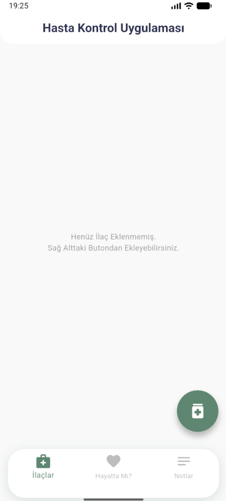
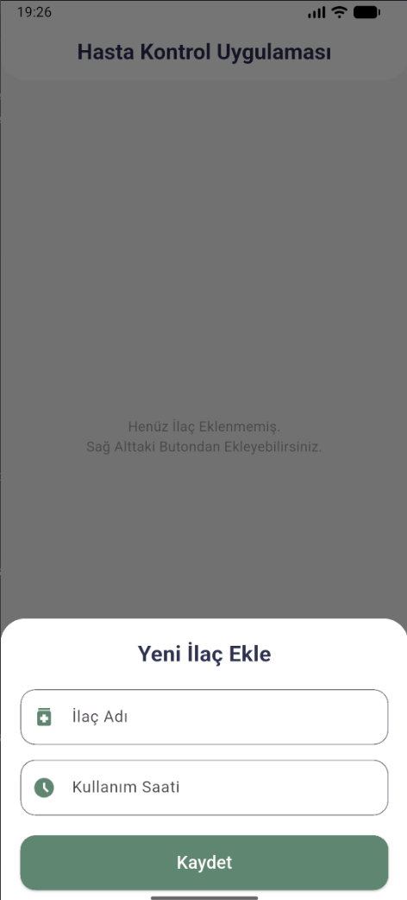
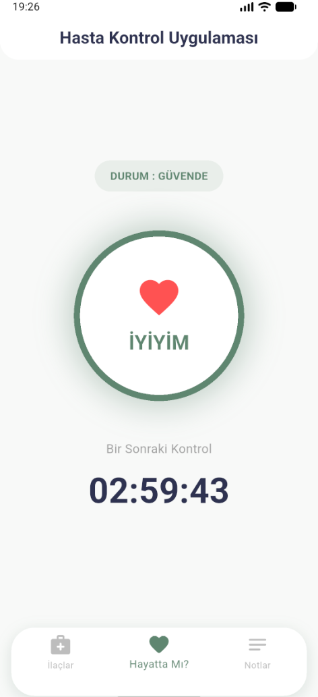
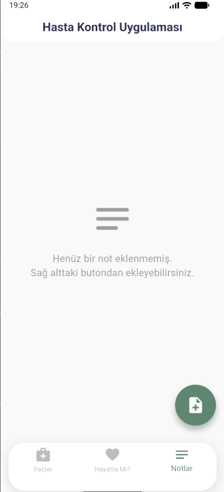
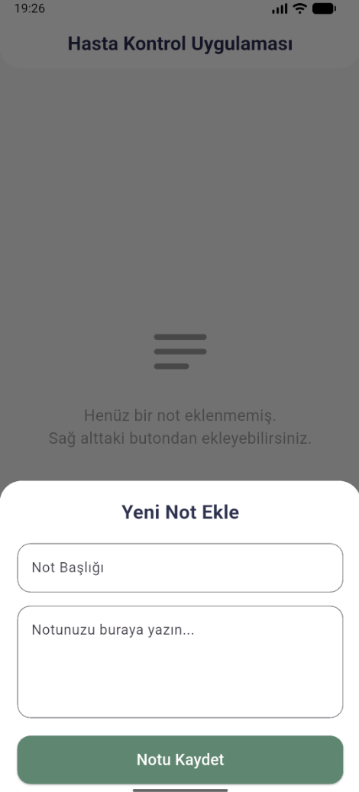

# 🩺 Patient Care Tracker App / Hasta & Yaşlı Takip Uygulaması

[English](#english) | [Türkçe](#türkçe)

---

## 🇬🇧 English

### About The Project
This is a Flutter mobile application developed to help track the daily health status, medication schedules, and personal notes of elderly individuals and patients.

> 🚧 **Project Status:** *Work in Progress (WIP)* — Core architecture, UI designs, and navigation logic are completed. Database integration and further enhancements are ongoing.

### 📱 Screenshots / Ekran Görüntüleri

| Screen 1 | Screen 2 | Screen 3 | Screen 4 | Screen 5 |
| :---: | :---: | :---: | :---: | :---: |
|  |  |  |  |  |

### ✨ Key Features
- **Safety Check Countdown:** A timer and validation button allowing patients to confirm they are safe at designated intervals.
- **Medication Tracker:** A module to log medication names and scheduled dosage times.
- **Personal Notes:** A dedicated UI to write and save status notes with titles and descriptions.

### 🏗️ Architecture & Technical Details
The project is structured following **Feature-First Clean Architecture** principles to ensure maintainability, testability, and scalability.

- **State Management:** BLoC / Cubit
- **Architecture:** Feature-Based Clean Architecture (`presentation`, `data`, `cubit` separation)
- **UI & Design:** Custom Color Palette & Clean Material Design

---

## 🇹🇷 Türkçe

### Proje Hakkında
Bu proje, yaşlı ve hastaların günlük sağlık durumlarını, ilaç takiplerini ve özel notlarını kontrol altında tutmak amacıyla geliştirilmiş bir Flutter mobil uygulama projesidir.

> 🚧 **Proje Durumu:** *Geliştirme Aşamasında (WIP)* — Temel mimari, UI tasarımları ve sayfa yönlendirmeleri tamamlanmış olup, veritabanı entegrasyonu ve geliştirmeler devam etmektedir.

### ✨ Öne Çıkan Özellikler
- **Geri Sayımlı Durum Kontrolü:** Hastanın/yaşlının belirlenen sürelerde güvende olduğunu doğrulamasını sağlayan buton ve zamanlayıcı.
- **İlaç Takip Sistemi:** Kullanılan ilaçların adlarını ve kullanım saatlerini kaydetme modülü.
- **Özel Notlar:** Hasta durumuna özel başlık ve açıklama içeren not alma arayüzü.

### 🏗️ Mimari ve Teknik Detaylar
Proje, sürdürülebilir ve ölçeklenebilir olması adına **Feature-First Clean Architecture** prensiplerine uygun olarak yapılandırılmıştır.

- **State Management:** BLoC / Cubit
- **Mimari:** Özellik Odaklı Temiz Mimari (`presentation`, `data`, `cubit` katmanları)
- **UI & Tasarım:** Özel Renk Paleti ve Material Design

---

## 📂 Project Structure / Proje Klasör Yapısı

lib/
├── core/
│    ├── constants/       # App colors & strings / Renkler ve metinler
│    └── dummy_data/      # Mock database / Test verileri
└── features/
├── home/            # Home page module / Ana sayfa
├── life_check/      # Safety check module / Durum kontrolü
├── medication/      # Medication module / İlaç takibi
└── notes/           # Notes module / Notlar

---

## 🛠️ Installation & Setup / Kurulum

1. Clone the repository / Repoyu klonlayın:  
   git clone https://github.com/irfanmetekendirci-lang/patient-care-tracker-hasta-yasli-takip.git

2. Install dependencies / Bağımlılıkları yükleyin:  
   flutter pub get

3. Run the application / Uygulamayı çalıştırın:  
   flutter run